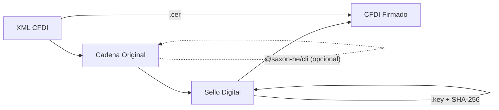

<p align="center">
  <a href="https://www.npmjs.com/package/@cfdi/xml">
    
  </a>
</p>

<h3 align="center">Librerias modernas para trabajar con CFDI 4.0 en Node.js</h3>

<p align="center">
  <a href="https://www.npmjs.com/package/@cfdi/xml">
    
  </a>
  <a href="https://www.npmjs.com/package/@cfdi/xml">
    
  </a>
  <a href="https://github.com/MisaelMa/node-cfdi/blob/main/LICENSE">
    
  </a>
  
  
</p>

<p align="center">
  <a href="https://cfdi.recreando.dev">
    
  </a>
</p>

---

## Ecosistema CFDI

<p align="center">
  
</p>

<table>
  <tr>
    <td align="center" width="33%">
      <a href="https://www.npmjs.com/package/@cfdi/complementos">
        
      </a>
    </td>
    <td align="center" width="33%">
      <a href="https://www.npmjs.com/package/@cfdi/xsd">
        
      </a>
    </td>
    <td align="center" width="33%">
      <a href="https://www.npmjs.com/package/@cfdi/csd">
        
      </a>
    </td>
  </tr>
  <tr>
    <td align="center" width="33%">
      <a href="https://www.npmjs.com/package/@cfdi/csf">
        
      </a>
    </td>
    <td align="center" width="33%">
      <a href="https://www.npmjs.com/package/@cfdi/catalogos">
        
      </a>
    </td>
    <td align="center" width="33%">
      <a href="https://www.npmjs.com/package/@cfdi/transform">
        
      </a>
    </td>
  </tr>
  <tr>
    <td align="center" width="33%">
      <a href="https://www.npmjs.com/package/@cfdi/elements">
        
      </a>
    </td>
    <td align="center" width="33%">
      <a href="https://www.npmjs.com/package/@cfdi/types">
        
      </a>
    </td>
    <td align="center" width="33%">
      <a href="https://www.npmjs.com/package/@cfdi/expresiones">
        
      </a>
    </td>
  </tr>
  <tr>
    <td align="center" width="33%">
      <a href="https://www.npmjs.com/package/@cfdi/xml2json">
        
      </a>
    </td>
    <td align="center" width="33%">
      <a href="https://www.npmjs.com/package/@cfdi/rfc">
        
      </a>
    </td>
    <td align="center" width="33%">
      <a href="https://www.npmjs.com/package/@cfdi/utils">
        
      </a>
    </td>
  </tr>
  <tr>
    <td align="center" width="33%">
      <a href="https://www.npmjs.com/package/@clir/openssl">
        
      </a>
    </td>
    <td align="center" width="33%">
      <a href="https://www.npmjs.com/package/@saxon-he/cli">
        
      </a>
    </td>
    <td align="center" width="33%">
    </td>
  </tr>
</table>

---

## Por que @cfdi/xml?

<table>
  <tr>
    <td width="25%" align="center"><b>Sin Java</b><br/><sub>Motor XSLT nativo en Node.js con <code>@cfdi/transform</code>. Saxon-HE disponible como alternativa.</sub></td>
    <td width="25%" align="center"><b>TypeScript nativo</b><br/><sub>Tipos estrictos, autocompletado y seguridad de tipos en todo el flujo de facturacion.</sub></td>
    <td width="25%" align="center"><b>SAT 4.0 compliant</b><br/><sub>Cumple con Anexo 20 del SAT. Genera XML valido contra esquemas XSD oficiales.</sub></td>
    <td width="25%" align="center"><b>Modular</b><br/><sub>Usa solo lo que necesitas. Cada paquete del ecosistema es independiente.</sub></td>
  </tr>
</table>

---

## Quick Start

### 1. Instalar

```bash
npm install @cfdi/xml
```

### 2. Crear y firmar un CFDI

```ts
import { CFDI, Emisor, Receptor, Concepto, Impuestos } from '@cfdi/xml';

const cfdi = new CFDI({
  xslt: { path: './resources/4.0/cadenaoriginal.xslt' },
});

cfdi.comprobante({
  Serie: 'A',
  Folio: '1',
  Fecha: '2024-01-15T10:30:00',
  FormaPago: '01',
  MetodoPago: 'PUE',
  TipoDeComprobante: 'I',
  LugarExpedicion: '64000',
  Moneda: 'MXN',
  SubTotal: '1000.00',
  Total: '1160.00',
});

cfdi.emisor(new Emisor({
  Rfc: 'AAA010101AAA',
  Nombre: 'Empresa SA de CV',
  RegimenFiscal: '601',
}));

cfdi.receptor(new Receptor({
  Rfc: 'BBB020202BBB',
  Nombre: 'Cliente SA de CV',
  UsoCFDI: 'G03',
  DomicilioFiscalReceptor: '64000',
  RegimenFiscalReceptor: '601',
}));

const concepto = new Concepto({
  ClaveProdServ: '01010101',
  Cantidad: '1',
  ClaveUnidad: 'E48',
  Descripcion: 'Servicio de consultoria',
  ValorUnitario: '1000.00',
  Importe: '1000.00',
  ObjetoImp: '02',
});
concepto.setTraslado({
  Base: '1000.00',
  Impuesto: '002',
  TipoFactor: 'Tasa',
  TasaOCuota: '0.160000',
  Importe: '160.00',
});
cfdi.concepto(concepto);

const impuestos = new Impuestos({
  TotalImpuestosTrasladados: '160.00',
});
impuestos.traslados({
  Impuesto: '002',
  TipoFactor: 'Tasa',
  TasaOCuota: '0.160000',
  Importe: '160.00',
  Base: '1000.00',
});
cfdi.impuesto(impuestos);
```

### 3. Certificar y sellar

```ts
cfdi.certificar('./certs/certificado.cer');
await cfdi.sellar('./certs/llave.key', '12345678a');
```

### 4. Obtener el XML

```ts
const xml = cfdi.getXmlCdfi();
```

---

## Flujo de firmado



---

## Output de ejemplo

```xml
<?xml version="1.0" encoding="utf-8"?>
<cfdi:Comprobante
  xmlns:cfdi="http://www.sat.gob.mx/cfd/4"
  xmlns:xsi="http://www.w3.org/2001/XMLSchema-instance"
  xsi:schemaLocation="http://www.sat.gob.mx/cfd/4 http://www.sat.gob.mx/sitio_internet/cfd/4/cfdv40.xsd"
  Version="4.0"
  Serie="A"
  Folio="1"
  Fecha="2024-01-15T10:30:00"
  FormaPago="01"
  MetodoPago="PUE"
  TipoDeComprobante="I"
  Moneda="MXN"
  SubTotal="1000.00"
  Total="1160.00"
  LugarExpedicion="64000"
  NoCertificado="20001000000300022815"
  Certificado="MIIFxTCCA62g..."
  Sello="GshKsM2IjAR0+7...">
  <cfdi:Emisor Rfc="AAA010101AAA" Nombre="Empresa SA de CV" RegimenFiscal="601"/>
  <cfdi:Receptor Rfc="BBB020202BBB" Nombre="Cliente SA de CV" UsoCFDI="G03"
    DomicilioFiscalReceptor="64000" RegimenFiscalReceptor="601"/>
  <cfdi:Conceptos>
    <cfdi:Concepto ClaveProdServ="01010101" Cantidad="1" ClaveUnidad="E48"
      Descripcion="Servicio de consultoria" ValorUnitario="1000.00"
      Importe="1000.00" ObjetoImp="02">
      <cfdi:Impuestos>
        <cfdi:Traslados>
          <cfdi:Traslado Base="1000.00" Impuesto="002" TipoFactor="Tasa"
            TasaOCuota="0.160000" Importe="160.00"/>
        </cfdi:Traslados>
      </cfdi:Impuestos>
    </cfdi:Concepto>
  </cfdi:Conceptos>
</cfdi:Comprobante>
```

---

## Motor XSLT

La cadena original se genera mediante transformacion XSLT. Se soportan dos motores:

| Motor               | Paquete           | Requiere Java | Default |
| ------------------- | ----------------- | ------------- | ------- |
| **@cfdi/transform** | `@cfdi/transform` | No            | Si      |
| **Saxon-HE**        | `@saxon-he/cli`   | Si            | No      |

```ts
// Default: @cfdi/transform (pure Node.js)
const cfdi = new CFDI({
  xslt: { path: './resources/4.0/cadenaoriginal.xslt' },
});

// Saxon-HE: requiere Java + Saxon instalado
const cfdiSaxon = new CFDI({
  xslt: { path: './resources/4.0/cadenaoriginal.xslt' },
  saxon: { binary: 'transform' },
});
```

---

## Compatibilidad

| Version CFDI | Soportado |
| ------------ | --------- |
| 4.0          | Si        |
| 3.3          | Si        |
| 3.2          | Si        |

**Complementos soportados:** Pagos 2.0, Nomina 1.2, Comercio Exterior 2.0, Carta Porte 3.1, Impuestos Locales, INE, Donatarias, Vehiculo Usado, entre otros.

---

## API

| Metodo                       | Descripcion                                           |
| ---------------------------- | ----------------------------------------------------- |
| `comprobante(attr)`          | Atributos del comprobante (Serie, Folio, Fecha, etc.) |
| `emisor(emisor)`             | Datos del emisor                                      |
| `receptor(receptor)`         | Datos del receptor                                    |
| `concepto(concepto)`         | Agrega un concepto (puede llamarse multiples veces)   |
| `impuesto(impuesto)`         | Resumen de impuestos del documento                    |
| `certificar(cerpath)`        | Carga certificado `.cer`                              |
| `sellar(keyfile, password)`  | Genera cadena original y sello digital                |
| `getXmlCdfi()`               | Retorna el XML firmado                                |
| `getJsonCdfi()`              | Retorna representacion JSON                           |
| `saveFile(file, path, name)` | Guarda archivo XML                                    |
| `generarCadenaOriginal()`    | Genera cadena original via XSLT                       |
| `setDebug(debug)`            | Activa/desactiva modo debug                           |

---

## Configuracion

```ts
interface Config {
  debug?: boolean;
  compact?: boolean;
  xslt?: { path: string };   // Ruta al archivo XSLT (requerido para sellar)
  saxon?: { binary: string }; // Si se omite, usa @cfdi/transform
  schema?: { path: string };
}
```

---

## Soporte

<p>
  <a href="https://github.com/MisaelMa/node-cfdi/issues">
    
  </a>
  <a href="https://github.com/MisaelMa/node-cfdi/discussions">
    
  </a>
  <a href="https://www.npmjs.com/package/@cfdi/xml">
    
  </a>
</p>

---

## Autor

<p align="center">
  <a href="https://github.com/MisaelMa">
    
  </a>
</p>

## Licencia

[MIT](../../LICENSE)
